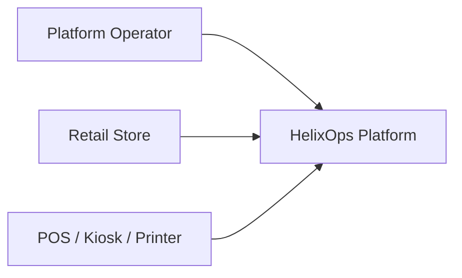
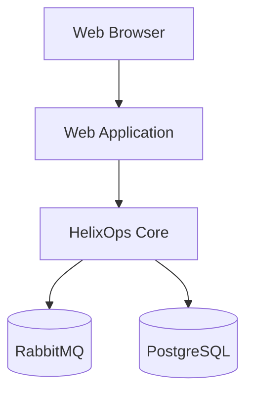
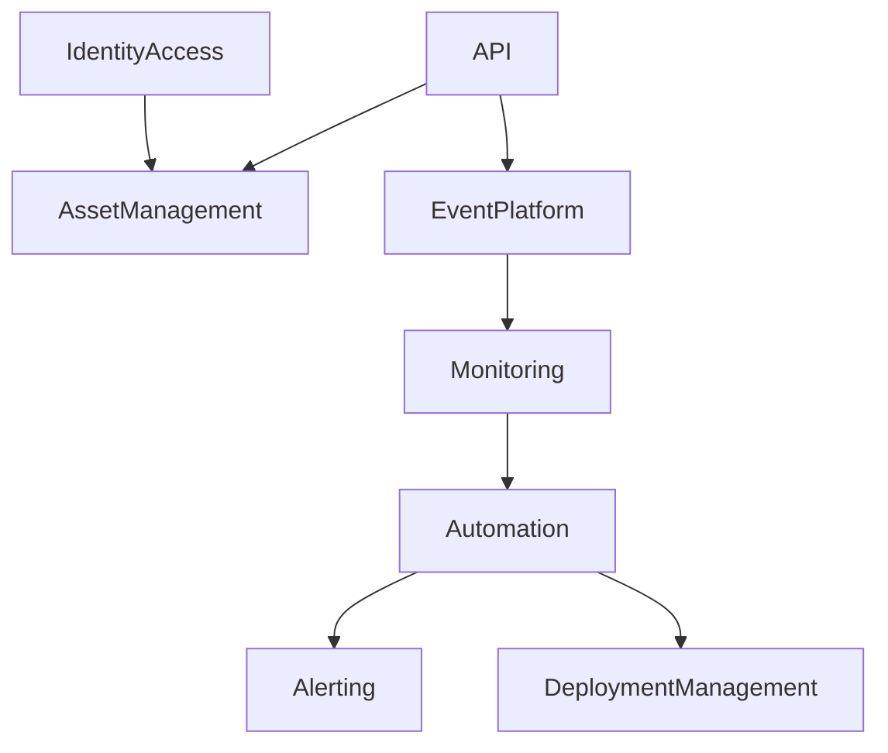
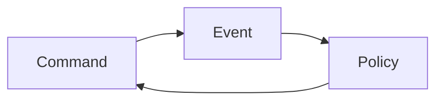
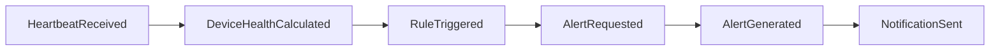
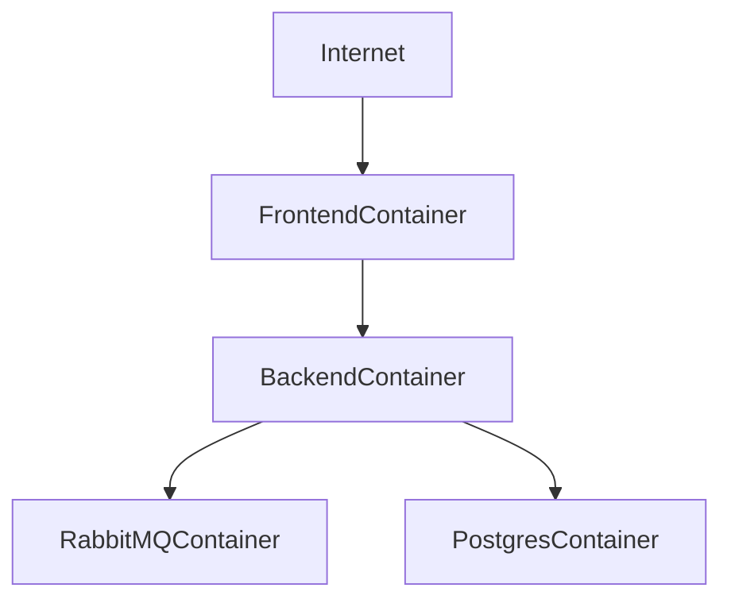
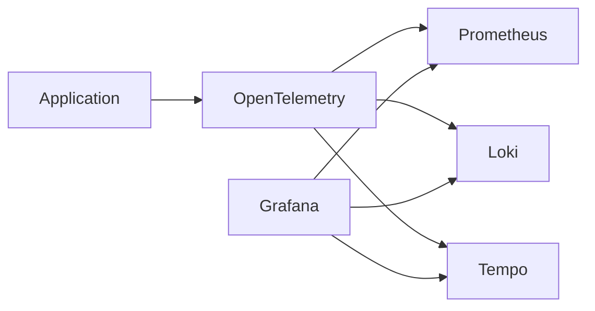

# HelixOps - Architecture

## Purpose

This document describes the logical and physical architecture of the HelixOps platform.

It defines how bounded contexts interact, how events flow through the platform and how the system can evolve from a modular monolith into a distributed architecture.

This document intentionally focuses on architecture rather than implementation details.

---

# Architectural Goals

HelixOps must support:

- Distributed asset management
- Operational monitoring
- Event-driven communication
- Automated remediation
- Deployment orchestration
- Observability
- Auditability
- Cloud-native evolution

---

# Architectural Principles

## Event First

Events are the primary communication mechanism between bounded contexts.

---

## Automation First

Operational responses should be automated whenever possible.

---

## Observability First

Every significant operation should generate telemetry.

---

## Modular By Design

Domain boundaries must exist regardless of deployment topology.

---

## Cloud Ready

Infrastructure dependencies should remain replaceable.

---

## Evolutionary Architecture

The platform must support gradual extraction of services without domain redesign.

---

# C4 - Level 1

## System Context



---

# C4 - Level 2

## Container Diagram



---

# Core Containers

## Web Application

Responsibilities:

- Operational dashboards
- Asset management
- Deployment management
- Alert visualization
- Rule administration

Technology (initial proposal):

```text
Next.js
TypeScript
```

---

## HelixOps Core

Responsibilities:

- Domain execution
- Command handling
- Event generation
- Policy execution
- Business workflows

Technology (initial proposal):

```text
ASP.NET Core
.NET 10
```

---

## RabbitMQ

Responsibilities:

- Event routing
- Event delivery
- Retry handling
- Dead-letter management

---

## PostgreSQL

Responsibilities:

- Operational persistence
- Event metadata
- Reporting
- Audit records

---

# Internal Architecture

HelixOps Core is organized as a Modular Monolith.



---

# Bounded Contexts

## Core Domains

```text
Event Platform
Automation & Rules Engine
```

---

## Operational Domain

```text
Asset Management
```

---

## Supporting Domains

```text
Monitoring
Alerting
Deployment Management
```

---

## Generic Domains

```text
Identity & Access
```

---

# Event Processing Architecture

The platform uses asynchronous event processing.



---

# Example Operational Flow



---

# Data Ownership

Each bounded context owns its data.

```text
Asset Management
  └── Assets

Monitoring
  └── Telemetry

Automation
  └── Rules

Alerting
  └── Alerts

Deployment Management
  └── Deployments

Identity
  └── Users
```

No context may directly modify another context's data.

---

# Deployment Topology (MVP)



---

# Docker Architecture

Initial deployment consists of:

```text
helixops-web
helixops-api
rabbitmq
postgres
```

Managed through:

```text
docker-compose
```

---

# Observability Architecture

Every component must emit:

## Logs

```text
Structured Logs
```

---

## Metrics

```text
Prometheus Metrics
```

---

## Traces

```text
OpenTelemetry Traces
```

---

# Observability Stack (Future)



---

# Security Architecture

Authentication:

```text
JWT
```

Authorization:

```text
Role Based Access Control (RBAC)
```

Future:

```text
OIDC
OAuth2
```

---

# Cloud Evolution Strategy

Phase 1

```text
Local Docker Environment
```

---

Phase 2

```text
CI/CD Pipeline
```

---

Phase 3

```text
Floci AWS Simulation
```

Services:

```text
SQS
SNS
S3
```

---

Phase 4

```text
Kubernetes
```

---

Phase 5

```text
AWS
```

---

# Service Extraction Strategy

Potential future extractions:

```text
Automation Worker
Monitoring Worker
Deployment Worker
```

Extraction must not change:

- Commands
- Events
- Policies

---

# Architectural Constraints

## Mandatory

- Event-driven communication
- Modular monolith boundaries
- Domain ownership
- Structured logging
- OpenTelemetry support

---

## Prohibited

- Shared mutable state between contexts
- Direct database access across contexts
- Infrastructure-specific domain logic

---

# Success Criteria

HelixOps architecture succeeds when:

- Operational workflows are event-driven.
- Automation can react without tight coupling.
- Events provide full traceability.
- Services can be extracted incrementally.
- Infrastructure remains replaceable.
