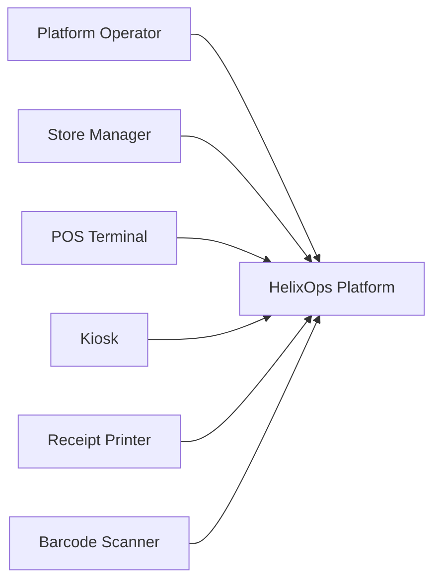

# C4 Level 1 - System Context

## Purpose

Describe how HelixOps interacts with users, devices and external systems.

---

# System Context Diagram

---

# Actors

## Platform Operator

Responsible for monitoring and operating the platform.

---

## Store Manager

Responsible for supervising retail locations.

---

# External Devices

## POS Terminal

Produces operational events.

---

## Kiosk

Produces operational events.

---

## Receipt Printer

Reports status and health.

---

## Barcode Scanner

Reports connectivity and operational telemetry.

---

# System Responsibilities

HelixOps provides:

- Asset visibility
- Monitoring
- Automation
- Alerting
- Deployment management
- Operational observability
