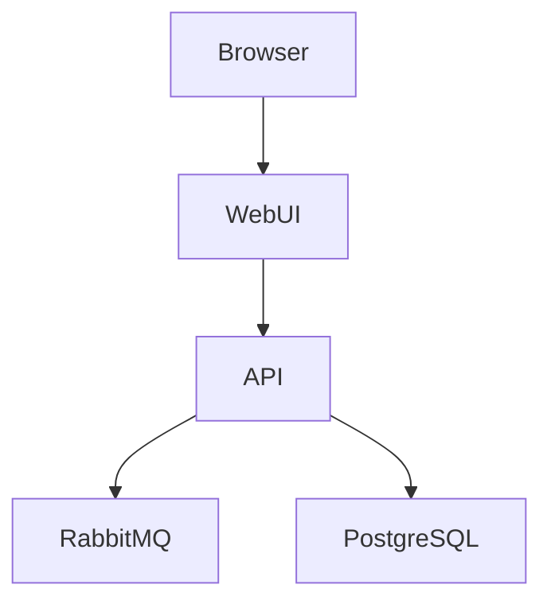

# C4 Level 2 - Container Diagram

## Purpose

Describe the deployable units that compose HelixOps.

---

# Container Diagram

---

# Containers

## Web UI

Technology:

Next.js (Future)

Initial Phase:

Swagger UI

Responsibilities:

- Dashboards
- Asset administration
- Alert management

---

## API

Technology:

ASP.NET Core

Responsibilities:

- Command processing
- Event publishing
- Domain orchestration

---

## RabbitMQ

Responsibilities:

- Event distribution
- Queue management

---

## PostgreSQL

Responsibilities:

- Operational persistence
- Audit data
- Reporting
