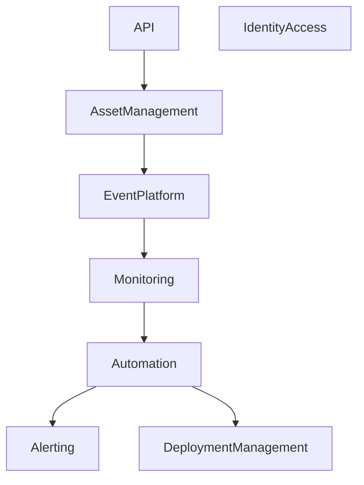

# C4 Level 3 - Component Diagram

## Purpose

Describe internal components inside the HelixOps Core.

---

# Component Diagram

---

# Components

## Asset Management

Responsibilities:

- Devices
- Locations
- Heartbeats

---

## Event Platform

Responsibilities:

- Event publishing
- Event routing
- Event subscriptions

---

## Monitoring

Responsibilities:

- Health calculations
- Metrics
- Telemetry

---

## Automation

Responsibilities:

- Rule evaluation
- Workflow execution

---

## Alerting

Responsibilities:

- Alerts
- Notifications

---

## Deployment Management

Responsibilities:

- Deployments
- Rollbacks

---

## Identity & Access

Responsibilities:

- Authentication
- Authorization
