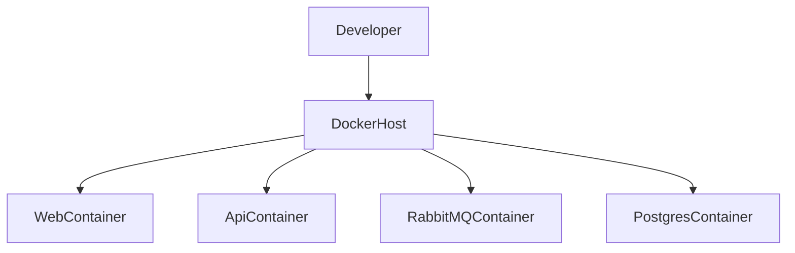
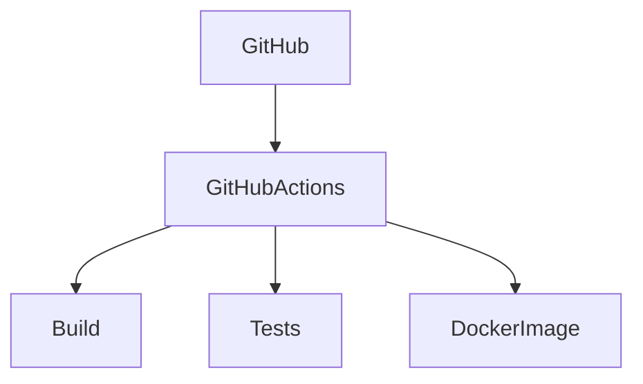
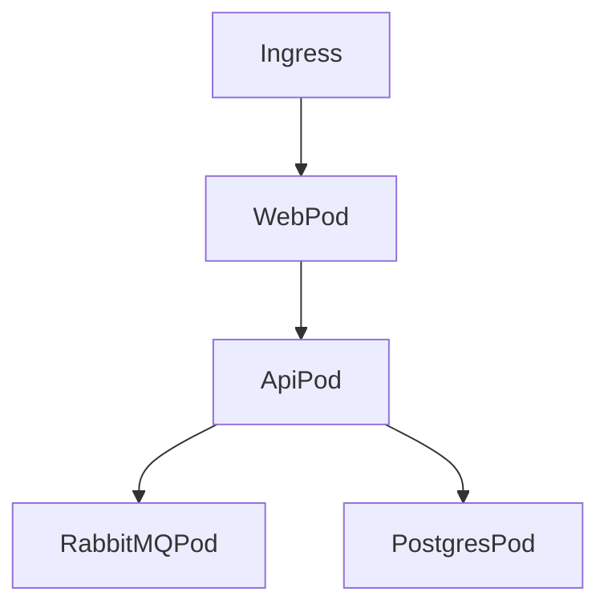

# C4 Level 4 - Deployment Diagram

## Purpose

Describe runtime deployment environments.

---

# Local Environment

---

# CI Environment

---

# Future Kubernetes Environment

---

# Future AWS Simulation

Using Floci.

Services:

- SNS
- SQS
- S3

---

# Future Production Environment

Target:

AWS

Potential Services:

- ECS
- EKS
- RDS
- SNS
- SQS
- CloudWatch
