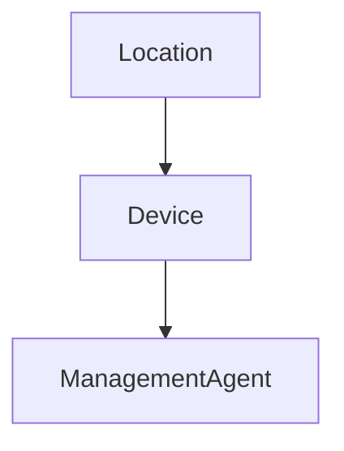

# HelixOps - Device Domain Model

## Purpose

Represents a physical or logical operational asset where software is executed via a ManagementAgent.

Devices are infrastructure entities that host operational capabilities.

Examples:

- POS Terminal
- Self Checkout Kiosk
- Printer
- Scanner
- Edge Server

---

# Aggregate Root

Device

---

# Identity

DeviceId

---

# Relationships

---

# Attributes

DeviceId
LocationId
SerialNumber
DeviceType
Manufacturer
Model
Status
CreatedAt
UpdatedAt

---

# Device Types

POS
KIOSK
PRINTER
SCANNER
EDGE_SERVER
CUSTOM

---

# Status

Active
Inactive
Maintenance
Retired

---

# MVP Constraint

A Device MUST have exactly one ManagementAgent.

This constraint simplifies deployment, monitoring, and lifecycle management.

---

# Invariants

- A Device must belong to a Location
- A Device must have a unique SerialNumber
- A Retired Device cannot register a new ManagementAgent
- A Device cannot exist without an associated ManagementAgent (MVP rule)

---

# Responsibilities

- Represent physical/edge infrastructure
- Host ManagementAgent
- Provide execution environment context
- Support operational grouping and filtering

---

# Non Responsibilities

- Health evaluation (Monitoring module)
- Deployment logic
- Automation logic
- Alerting logic

---

# Commands

RegisterDevice
UpdateDevice
RetireDevice

---

# Events

DeviceRegistered
DeviceUpdated
DeviceRetired

---

# Notes

Device is intentionally lightweight.

All operational intelligence is delegated to ManagementAgent and Monitoring.
