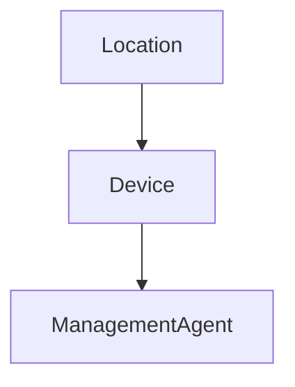

# HelixOps - Location Domain Model

## Purpose

Represents a physical operational site managed by HelixOps.

Locations are the top-level organizational unit where Devices and Management Agents operate.

Examples:

- Retail Store
- Warehouse
- Airport Kiosk Zone
- Restaurant Branch

---

# Aggregate Root

Location

---

# Identity

LocationId

---

# Attributes

LocationId
Code
Name
Description
Country
Region
City
Address
Status
CreatedAt
UpdatedAt

---

# Status

Active
Inactive
Closed

---

# Invariants

- A Location must have a unique Code
- A Location must have a Name
- A Closed Location cannot register new Devices
- A Closed Location cannot register new ManagementAgents indirectly

---

# Relationships

---

# Responsibilities

- Manage operational sites
- Group Devices logically
- Provide organizational boundaries for operations
- Support filtering and aggregation for Monitoring and Reporting

---

# Commands

CreateLocation
UpdateLocation
CloseLocation
ActivateLocation

---

# Events

LocationCreated
LocationUpdated
LocationClosed
LocationActivated

---

# Notes

Location does NOT manage operational health.

Health is computed by Monitoring module and is not part of this aggregate.
