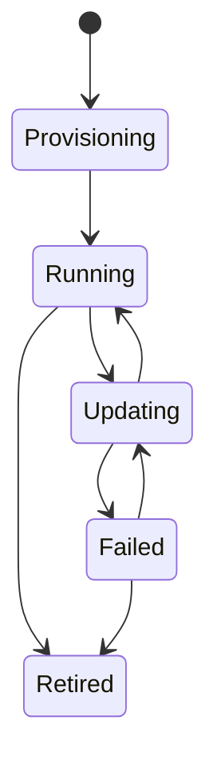

# HelixOps - Management Agent Lifecycle

## Purpose

Defines the valid lifecycle states and transitions of a ManagementAgent.

The lifecycle is used by:

- Asset Management
- Monitoring
- Deployment Management
- Automation

---

# State Machine



---

# Important Design Decision

Offline and Degraded are NOT aggregate states.

They are Monitoring evaluations.

The aggregate only stores operational lifecycle state.

Monitoring determines health projections separately.

---

# Aggregate States

## Provisioning

Description:

Agent has been registered but is not yet operational.

Allowed Commands:

- ReportAgentVersion

Transitions:

Provisioning -> Running

Generated Events:

- AgentRegistered

---

## Running

Description:

Normal operational state.

Allowed Commands:

- SendAgentHeartbeat
- StartAgentUpdate
- RetireAgent

Transitions:

Running -> Updating

Running -> Retired

---

## Updating

Description:

Software update is currently executing.

Allowed Commands:

- CompleteAgentUpdate
- FailAgentUpdate

Transitions:

Updating -> Running

Updating -> Failed

Generated Events:

- AgentUpdateStarted

---

## Failed

Description:

Update process failed.

Allowed Commands:

- StartAgentUpdate
- ExecuteRollback
- RetireAgent

Transitions:

Failed -> Updating

Failed -> Retired

Generated Events:

- AgentUpdateFailed

---

## Retired

Description:

Terminal state.

No operational activity is allowed.

Allowed Commands:

None

Transitions:

None

Generated Events:

- AgentRetired

---

# Health Projection

Health is maintained by Monitoring.

Possible health values:

Healthy

Degraded

Offline

---

# Example

```text
AgentHeartbeatReceived
        ↓
EvaluateAgentHealth
        ↓
AgentHealthCalculated
        ↓
Health = Healthy
```

---

# Architectural Rule

Lifecycle State:

Managed by Asset Management.

Health State:

Managed by Monitoring.

These concepts must never be mixed.

---

# Future Evolution

Potential future lifecycle states:

Paused

Maintenance

RollbackInProgress

PluginInstallation

ContainerDeployment
