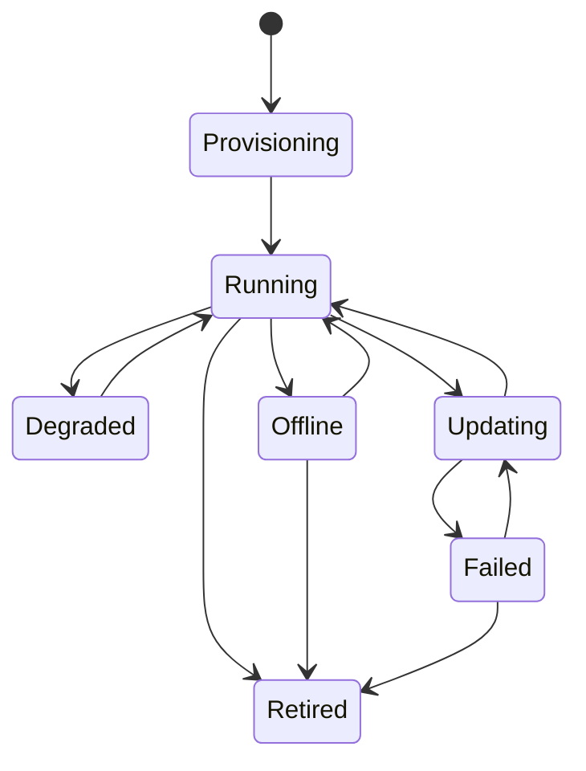

# Management Agent Lifecycle

## Purpose

Defines the valid operational states and transitions of a ManagementAgent.

The lifecycle governs monitoring, automation, alerting and deployment behaviors.

---

# State Machine

---

# States

## Provisioning

Description:

Agent has been registered but is not yet operational.

Characteristics:

- Newly created
- Not receiving commands
- Not participating in automation

Allowed Commands:

- ActivateAgent

Generated Events:

- AgentRegistered

---

## Running

Description:

Normal operational state.

Characteristics:

- Receives heartbeats
- Accepts deployments
- Participates in monitoring

Allowed Commands:

- SendHeartbeat
- StartUpdate
- RetireAgent

Generated Events:

- AgentHeartbeatReceived

---

## Degraded

Description:

Agent is operational but experiencing issues.

Examples:

- High latency
- Resource pressure
- Partial failures

Allowed Commands:

- SendHeartbeat
- StartUpdate
- RetireAgent

Generated Events:

- AgentDegraded

---

## Offline

Description:

No heartbeat received within expected interval.

Characteristics:

- Considered unavailable
- Generates operational alerts

Allowed Commands:

- RetireAgent

Generated Events:

- AgentOffline

---

## Updating

Description:

Deployment operation in progress.

Characteristics:

- Version transition occurring
- Monitoring remains active

Allowed Commands:

- CompleteUpdate
- FailUpdate

Generated Events:

- AgentUpdateStarted

---

## Failed

Description:

Agent update failed.

Characteristics:

- Requires retry or rollback

Allowed Commands:

- RetryUpdate
- RetireAgent

Generated Events:

- AgentUpdateFailed

---

## Retired

Description:

Agent permanently removed from operation.

Characteristics:

- Terminal state

Allowed Commands:

None

Generated Events:

- AgentRetired
