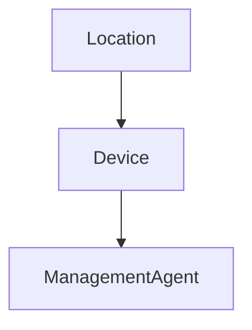

# HelixOps - Management Agent Domain Model

## Purpose

Represents the Helix Edge Agent installed on a Device.

The Management Agent is the primary operational entity of the HelixOps MVP.

It provides connectivity, telemetry, deployment execution and remote management capabilities.

---

# Aggregate Root

ManagementAgent

---

# Identity

AgentId

---

# Relationships

---

# Ownership

Owned By:

Asset Management

---

# Attributes

AgentId

DeviceId

Name

Version

Status

LastHeartbeatAt

RegisteredAt

UpdatedAt

---

# MVP Constraint

A Device must have exactly one ManagementAgent.

Future versions may support multiple agents per device.

---

# Status

Provisioning

Running

Degraded

Offline

Updating

Failed

Retired

---

# Invariants

A ManagementAgent must belong to a Device.

A ManagementAgent must have a Version.

A Retired ManagementAgent cannot receive updates.

A Retired ManagementAgent cannot receive heartbeats.

A Device cannot contain more than one active ManagementAgent in MVP.

---

# Commands

RegisterAgent

RetireAgent

ReportAgentVersion

SendAgentHeartbeat

StartAgentUpdate

CompleteAgentUpdate

FailAgentUpdate

ExecuteRollback

---

# Events

AgentRegistered

AgentRetired

AgentVersionReported

AgentHeartbeatReceived

AgentUpdateStarted

AgentUpdateSucceeded

AgentUpdateFailed

---

# Responsibilities

Provide operational connectivity.

Provide telemetry.

Receive deployments.

Execute updates.

Report health signals.

Support automation workflows.

---

# Non Responsibilities

Business Logic

Retail Operations

Alert Management

Health Evaluation

Rule Execution

These responsibilities belong to other modules.

---

# Future Evolution

Future versions may support:

- Multiple Agents per Device
- Agent Plugins
- Workload Management
- Container Runtime Integration
