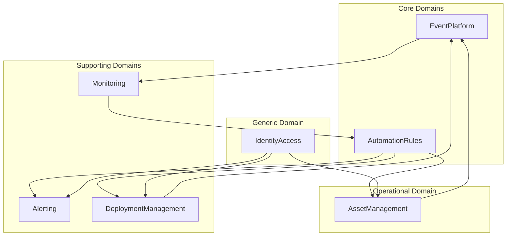

# HelixOps - Modules v2

## Purpose

This document defines the bounded contexts and functional domains that compose the HelixOps platform.

HelixOps is an Event-Driven Operations Platform designed to observe, automate and operate distributed systems.

The platform follows an Event-First architecture where all operational activities are represented as events and processed through a centralized event platform.

---

# Domain Classification

| Domain Type        | Context                   |
| ------------------ | ------------------------- |
| Core Domain        | Event Platform            |
| Core Domain        | Automation & Rules Engine |
| Operational Domain | Asset Management          |
| Supporting Domain  | Monitoring                |
| Supporting Domain  | Alerting                  |
| Supporting Domain  | Deployment Management     |
| Generic Domain     | Identity & Access         |

---

# Context Map



---

# 1. Event Platform

## Description

The Event Platform is the central nervous system of HelixOps.

Every significant operational action is represented as an event and flows through this domain.

The Event Platform is responsible for publishing, routing, auditing and replaying events across the platform.

---

## Responsibilities

- Event publishing
- Event routing
- Event subscriptions
- Event persistence
- Event replay
- Event auditing
- Event history
- Event traceability

---

## Produces

```text
EventStored
EventPublished
EventReplayed
```

---

## Consumes

```text
All platform events
```

---

## Owned Concepts

```text
Event
EventStream
EventSubscription
EventAudit
EventMetadata
```

---

# 2. Automation & Rules Engine

## Description

Automation & Rules Engine is responsible for evaluating operational conditions and executing automated actions.

This domain transforms operational insights into platform reactions.

It is one of the core differentiators of HelixOps.

---

## Responsibilities

- Rule evaluation
- Automation workflows
- Incident response orchestration
- Automated remediation
- Operational decision execution
- Action triggering

---

## Produces

```text
RuleTriggered
AutomationStarted
AutomationCompleted
AutomationFailed
RollbackRequested
DeploymentRequested
AlertRequested
DeviceMaintenanceRequested
```

---

## Consumes

```text
DeviceHealthCalculated
LocationHealthCalculated
DeploymentFailed
DeploymentSucceeded
MetricThresholdExceeded
QueueDepthExceeded
```

---

## Owned Concepts

```text
Rule
Automation
AutomationExecution
Condition
Action
Policy
```

---

## Example Scenarios

### Device Offline

```text
DeviceMarkedOffline
↓
RuleTriggered
↓
AlertRequested
```

### Deployment Failure

```text
DeploymentFailed
↓
RuleTriggered
↓
RollbackRequested
```

### Version Drift

```text
DeviceVersionOutdated
↓
RuleTriggered
↓
DeploymentRequested
```

---

# 3. Asset Management

## Description

Responsible for managing operational assets distributed across the organization.

Assets provide operational context and act as producers of platform events.

---

## Responsibilities

### Location Management

- Stores
- Warehouses
- Offices
- Branches
- Edge Sites

### Device Management

- POS
- Kiosks
- Printers
- Scanners
- Tablets
- Edge Nodes

### Device Health Registration

- Heartbeats
- Connectivity
- Version reporting

---

## Produces

```text
LocationCreated
LocationActivated
LocationClosed

DeviceRegistered
DeviceOnline
DeviceOffline
HeartbeatReceived
DeviceDecommissioned

DeviceVersionReported
```

---

## Consumes

```text
DeploymentAssigned
DeviceMaintenanceRequested
```

---

## Owned Concepts

```text
Location
Device
Heartbeat
DeviceVersion
```

---

# 4. Monitoring

## Description

Monitoring transforms operational events into telemetry and health information.

Monitoring is responsible for understanding the health of the platform and its managed assets.

---

## Responsibilities

- Metrics collection
- Availability tracking
- Health evaluation
- Telemetry generation
- Performance monitoring
- Device monitoring

---

## Produces

```text
MetricRecorded
HealthEvaluated

DeviceHealthCalculated
LocationHealthCalculated

MetricThresholdExceeded

QueueDepthExceeded

ServiceHealthCalculated
```

---

## Consumes

```text
HeartbeatReceived
DeviceOnline
DeviceOffline

DeploymentStarted
DeploymentSucceeded
DeploymentFailed
```

---

## Owned Concepts

```text
Metric
HealthStatus
AvailabilityIndicator
Telemetry
```

---

# 5. Alerting

## Description

Responsible for communicating operational incidents to platform operators.

Alerting does not decide when an alert should exist.

It communicates decisions produced by the Automation & Rules Engine.

---

## Responsibilities

- Alert lifecycle management
- Notification delivery
- Escalation flows
- Incident communication

---

## Produces

```text
AlertGenerated
AlertAcknowledged
AlertResolved
NotificationSent
```

---

## Consumes

```text
AlertRequested
```

---

## Owned Concepts

```text
Alert
Incident
Notification
Escalation
```

---

# 6. Deployment Management

## Description

Responsible for software distribution and deployment orchestration across distributed assets.

---

## Responsibilities

- Deployment orchestration
- Rollout management
- Rollback management
- Version tracking
- Deployment targeting

---

## Produces

```text
DeploymentStarted
DeploymentAssigned
DeploymentSucceeded
DeploymentFailed

RollbackStarted
RollbackCompleted
```

---

## Consumes

```text
DeploymentRequested
RollbackRequested

DeviceRegistered
DeviceOnline
```

---

## Owned Concepts

```text
Deployment
Release
Version
DeploymentTarget
```

---

# 7. Identity & Access

## Description

Provides authentication and authorization services across the platform.

---

## Responsibilities

- User management
- Authentication
- Authorization
- Access control
- Role management

---

## Produces

```text
UserCreated
UserActivated
RoleAssigned
PermissionGranted
```

---

## Consumes

None

````

---

## Owned Concepts

```text
User
Role
Permission
AccessPolicy
````

---

# Architectural Principles

## Event-First

Every relevant operational activity must generate an event.

---

## Automation-First

The platform should automate operational responses whenever possible.

---

## Observability-First

Every operational action should generate telemetry.

---

## Cloud-Native

All modules should remain deployable in local and cloud environments.

---

## Loose Coupling

Modules should communicate through events whenever possible.

---

## Auditability

Every significant operational action must be traceable through event history.

---

# Product Vision Alignment

HelixOps is not merely a monitoring platform.

HelixOps is an Event-Driven Operations Platform capable of:

1. Observing distributed systems.
2. Understanding operational conditions.
3. Executing automated actions.
4. Assisting operators in maintaining system health.

Core operational flow:

```
Observe
↓
Understand
↓
Decide
↓
Act
↓
Audit

```
