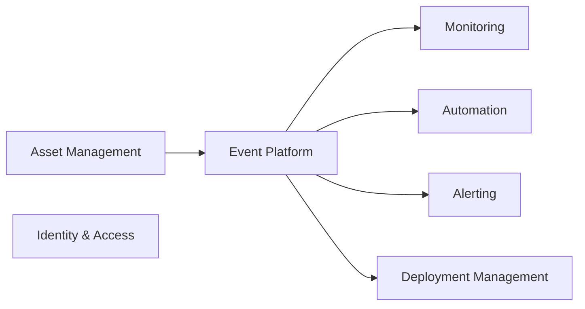

# HelixOps - Modules

## Purpose

Defines the bounded contexts that compose the HelixOps platform and their responsibilities.

The platform follows a Modular Monolith architecture with Event-Driven communication between modules.

---

# Architectural Principles

Modules communicate through:

- Commands
- Domain Events
- Policies

Modules must never communicate through direct database access.

Modules must own their data and business rules.

---

# Module Overview

---

# Asset Management

## Purpose

Manage operational assets participating in HelixOps workflows.

Asset Management is responsible for inventory and lifecycle management.

---

## Owned Aggregates

### Location

Represents a physical operational site.

Examples:

- Retail Store
- Warehouse
- Airport
- Restaurant

---

### Device

Represents a physical or logical operational asset.

Examples:

- POS Terminal
- Kiosk
- Receipt Printer
- Barcode Scanner

---

### ManagementAgent

Represents the Helix Edge Agent installed on a Device.

Responsibilities:

- Connectivity
- Inventory reporting
- Telemetry reporting
- Deployment execution
- Command execution

---

## Current MVP Constraint

A Device must have exactly one ManagementAgent.

Future versions may support multiple ManagementAgents.

---

## Responsibilities

- Register locations
- Register devices
- Register agents
- Maintain asset inventory
- Track software versions
- Maintain asset lifecycle

---

## Events Produced

LocationCreated

LocationClosed

DeviceRegistered

DeviceRetired

AgentRegistered

AgentRetired

AgentVersionReported

AgentHeartbeatReceived

---

## Events Consumed

DeploymentAssigned

AgentUpdateSucceeded

AgentUpdateFailed

---

# Monitoring

## Purpose

Transform operational signals into health information.

Monitoring evaluates asset health based on telemetry and heartbeats.

---

## Responsibilities

- Health calculation
- Connectivity evaluation
- Availability monitoring
- Health projections

---

## Events Produced

AgentHealthCalculated

AgentRecovered

---

## Commands Consumed

EvaluateAgentHealth

---

# Automation

## Purpose

Execute operational decisions automatically.

---

## Responsibilities

- Rule evaluation
- Workflow execution
- Operational automation

---

## Events Produced

RuleTriggered

AutomationExecuted

---

# Alerting

## Purpose

Generate and manage operational alerts.

---

## Responsibilities

- Alert lifecycle
- Incident communication
- Alert acknowledgment

---

## Events Produced

AlertGenerated

AlertAcknowledged

AlertResolved

---

# Deployment Management

## Purpose

Manage ManagementAgent software updates.

---

## Responsibilities

- Version rollout
- Deployment orchestration
- Rollback execution

---

## Events Produced

AgentUpdateStarted

AgentUpdateSucceeded

AgentUpdateFailed

RollbackStarted

RollbackSucceeded

---

# Identity & Access

## Purpose

Authentication and authorization.

---

## Responsibilities

- Authentication
- Authorization
- RBAC

---

# Event Platform

## Purpose

Provide asynchronous communication between modules.

---

## Responsibilities

- Event publishing
- Event subscriptions
- Correlation tracking
- Event routing

---

# Core Domain

The current Core Domain of HelixOps is:

Automation

Supported by:

Monitoring

Asset Management

Deployment Management
