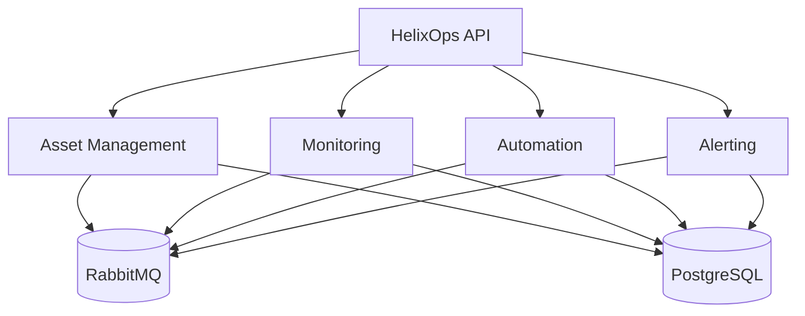
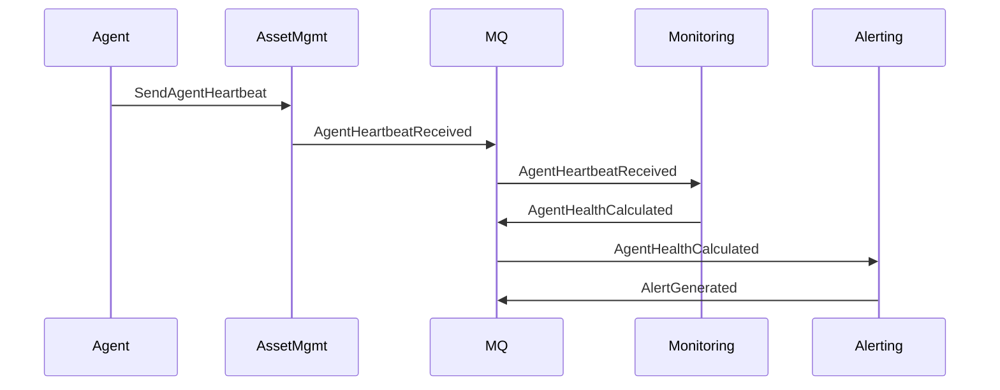

# HelixOps - Sprint 0

## Purpose

Sprint 0 establishes the foundational infrastructure and skeleton architecture for HelixOps.

The goal is NOT to build features.

The goal is to establish:

- Solution structure
- Modular monolith boundaries
- Messaging backbone
- Persistence baseline
- First end-to-end heartbeat flow (minimal vertical slice)

---

# Guiding Principles

- Build vertical slices, not layers
- Event-driven communication only between modules
- No direct cross-module database access
- Every module owns its data
- Monitoring and Automation are downstream consumers, not orchestrators
- Keep MVP scope constrained to ManagementAgent lifecycle

---

# MVP Scope (Strict)

We ONLY implement:

- Location Registry
- Device Registry
- ManagementAgent lifecycle
- Agent heartbeat ingestion
- Basic health evaluation (Monitoring)
- Simple alert generation

We DO NOT implement:

- Workloads
- Multi-agent per device
- AI automation
- Predictive systems
- Plugin architecture

---

# Target Architecture



---

# Solution Structure (.NET)

```text
helixops.sln

/src

  /BuildingBlocks
    - HelixOps.BuildingBlocks.Domain
    - HelixOps.BuildingBlocks.Application
    - HelixOps.BuildingBlocks.Infrastructure
    - HelixOps.BuildingBlocks.Messaging

  /Services

    /AssetManagement
      - HelixOps.AssetManagement.API
      - HelixOps.AssetManagement.Application
      - HelixOps.AssetManagement.Domain
      - HelixOps.AssetManagement.Infrastructure

    /Monitoring
      - HelixOps.Monitoring.API
      - HelixOps.Monitoring.Application
      - HelixOps.Monitoring.Domain
      - HelixOps.Monitoring.Infrastructure

    /Automation
      - HelixOps.Automation.API
      - HelixOps.Automation.Application
      - HelixOps.Automation.Domain
      - HelixOps.Automation.Infrastructure

    /Alerting
      - HelixOps.Alerting.API
      - HelixOps.Alerting.Application
      - HelixOps.Alerting.Domain
      - HelixOps.Alerting.Infrastructure
```

---

# Infrastructure (Local Dev)

## Required

- Docker
- Docker Compose
- .NET 8+
- RabbitMQ
- PostgreSQL

---

## docker-compose.yml

Services:

- rabbitmq
- postgres
- helixops-api (optional gateway in MVP)

---

# First End-to-End Flow (CRITICAL)

## Flow: Agent Heartbeat → Health Evaluation → Alert



---

# Sprint Goals

## Goal 1 - Skeleton

- Create solution structure
- Setup modular monolith boundaries
- Shared building blocks

---

## Goal 2 - Infrastructure

- PostgreSQL running locally
- RabbitMQ running locally
- Basic Docker Compose

---

## Goal 3 - Asset Management MVP

- Register Location
- Register Device
- Register ManagementAgent
- Send heartbeat endpoint

---

## Goal 4 - Event Pipeline

- Publish AgentHeartbeatReceived
- Consume in Monitoring module

---

## Goal 5 - Monitoring MVP

- Evaluate agent health
- Publish AgentHealthCalculated

---

## Goal 6 - Alerting MVP

- Generate alert on offline condition

---

# Definition of Done

A feature is considered DONE when:

- It emits correct domain events
- It is consumed asynchronously where required
- It respects module boundaries
- It is testable in isolation
- It can be executed via Docker locally

---

# Success Criteria

At the end of Sprint 0 we must demonstrate:

1. Register Device
2. Register Agent
3. Send heartbeat
4. System evaluates health
5. Alert is generated if agent becomes offline

---

# Key Architectural Validation

If Sprint 0 is successful, we validate:

- Event-driven architecture works end-to-end
- Modules are properly isolated
- RabbitMQ acts as integration backbone
- Monitoring is reactive, not proactive
- Domain model is stable enough for expansion

---

# Risks

- Over-engineering early abstractions
- Premature multi-agent support
- Mixing lifecycle vs health states
- Tight coupling between modules

---

# Exit Criteria

Sprint 0 is complete when:

- Full heartbeat → alert pipeline works
- No synchronous cross-module calls exist
- All modules can be started independently
- Events are visible in RabbitMQ
